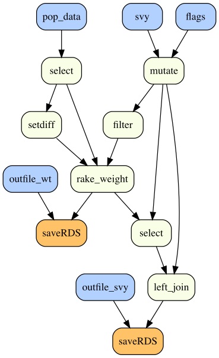
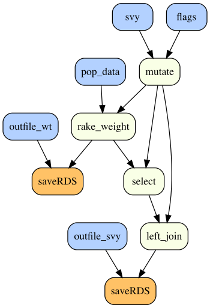
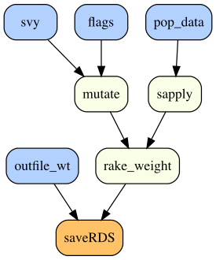
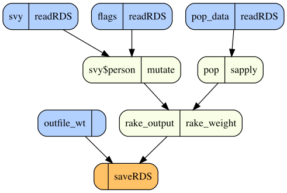

# dfgraph

Visualize how data flows through an R script to illuminate unfamiliar workflows and inform your coding decisions. 

We data scientists don't exactly write beautiful production-quality code. Let's be honest, it's more likely to be bewildering spaghetti code, and if you're like me, you've gotten to enjoy the exquisite torture of deciphering someone else's "workflow" (or your own for that matter). Why not profit from my past suffering with a tool to help navigate this quagmire of noodly computerspeak?

### Features

- Parse and visualize a dependency graph for R expressions (as nodes) within an R or Rmd script (recursively parsing any `source` files included therein).

- Selectively prune (i.e., exclude) nodes from the visual while propagating their dependencies (including any global dependencies of assigned functions).

- Optionally focus only on the network of dependencies for a specified node.

- Display R code for an expression (node) on hover, optionally including all preceeding code which the selected expression depends upon.

### Note 

This package is in a **pre-alpha state** and not yet intended for serious use (although you're welcome to test/experiment). There will likely be major changes in the near future (e.g., to enable interactivity). There are also certain (probably fundamental) [limitations](#limitations) to parsing dependencies from an R script, although I think `dfgraph` can cover enough of the common patterns to prove useful.

## Installation

From the R console:

```r
install.packages("remotes")
remotes::install_github("dkary/dfgraph")
```

## Basic Usage

Run `dfgraph::plot_flow("path_to_R_or_Rmd_file")` from the R console (which leverages the [DiagrammeR](https://github.com/rich-iannone/DiagrammeR) package with a   [DOT](https://en.wikipedia.org/wiki/DOT_(graph_description_language)) format under the hood).

```r
# Example
dfgraph::plot_flow(
    "testdat/svy-weight.R",
    # exclude diagnostic checks from the plot
    prune_labels = c("count", "summary", "sapply", "glimpse", "all.equal")
)
```



## Customize

### Prune Mutate Nodes

Some nodes have only one dependency (referred to as "mutates"), and we can collapse these into their parent nodes:

```r
dfgraph::plot_flow(
    "testdat/svy-weight.R", prune_all_mutates = TRUE,
    prune_labels = c("count", "summary", "sapply", "glimpse", "all.equal")
)
```



### Focus on one Node

Focus on the network of a specified node (which you can reveal interactively by hovering over a node):

```r
dfgraph::plot_flow(
    "testdat/svy-weight.R", prune_all_mutates = TRUE, focus_node = 20, 
)
```



### Display more Info

We can also display both assignment and primary function for each node:

```r
dfgraph::plot_flow(
    "testdat/svy-weight.R", prune_all_mutates = TRUE, focus_node = 20, 
    label_option = "both"
)
```



## Limitations

The most obvious limitation is that code is inherently flexible, and I won't be able to capture all the ways people might program. For example:

- We can misidentify dependencies due to name scoping (e.g., dataframe$column "d" vs. global variable "d") with non-standard evaluation (e.g., in `dplyr`).

However, I suspect that I can capture enough of the common data science coding patterns for the package to nonetheless be useful (more details in [Proof of Concept](ref/POC.md)).
