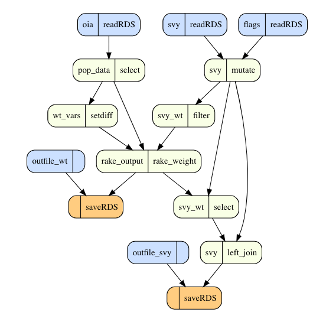

# dataflow

Visualize how data flows through an R script to better understand unfamiliar (or complex) workflows. Maybe even leverage `dataflow` when writing code to steer towards better patterns.

Note: This package is in a **pre-alpha state** and not yet intended for serious use (although you're welcome to test/experiment). There will likely be major changes in the near future (e.g., to enable interactivity).

## Installation

From the R console:

```r
install.packages("remotes")
remotes::install_github("dkary/dataflow")
```

## Usage

Currently only static plots can be produced (although code is viewable on hover by leveraging the [DiagrammeR](https://github.com/rich-iannone/DiagrammeR) package):

```r
dataflow::plot_flow(
    "testdat/svy-weight.R",
    # to exclude diagnostic checks from the plot
    prune_labels = c("count", "summary", "sapply", "glimpse", "all.equal")
)
```



## Limitations

The most obvious limitation is that code is inherently flexible, and I won't be able to capture all the ways people might program. For example:

- We can misidentify dependencies due to name scoping (e.g., column "d" vs. dataframe "d") with non-standard evaluation (e.g., in `dplyr`).

However, I suspect that I can capture enough of the common data science coding patterns for the package to nonetheless be useful (more details in [Proof of Concept](ref/POC.md)).
